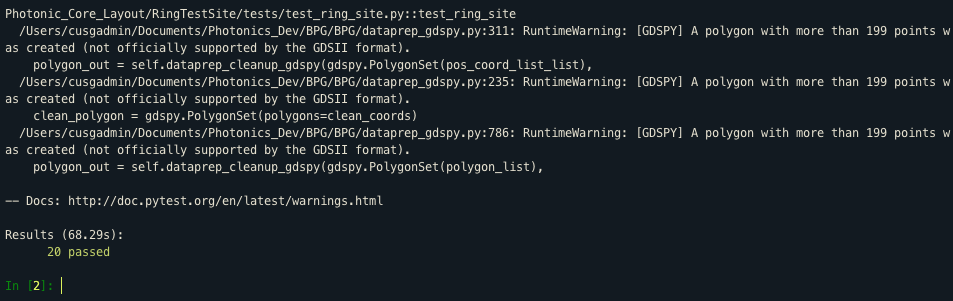

# Installing BPG
The first step to setting up BPG is installing the source code and all associated dependencies from github.   

## Prerequisites
It is highly recommended that you use Anaconda to contain your Python environment setup. This will isolate your 
system Python installation from your BPG Python installation to minimize unforseen issues. Please install Anaconda 
with a version >= Python 3.6. This can be found at the [Anaconda Website](https://www.anaconda.com/download)

This guide also assumes that you have a github account with working ssh keys. You will not be able to clone the 
repositories without it.

## Github installation
The Berkeley Analog Generator, which BPG relies on for core infrastructure, requires a very specific file structure 
and environmental variables. 

- To immediately download a fully working file structure, clone the Photonics_Dev 
repository with `git clone git@github.com:pvnbhargava/Photonics_Dev.git`. 
 This repository should contain several submodules which we will setup and install now:
```bash
cd Photonics_Dev
git submodule init
git submodule update
```
- Install the included python packages with the pip editable option. This will allow you to pull from git and 
automatically use any new changes:
```bash
pip install -e gdspy
pip install -e BPG
pip install -e BAG_framework
```
- You will also need to install a few extra BAG dependencies which are missing from its `setup.py`:
```bash
conda install shapely
conda install rtree
```
- To test and make sure your installation works properly, launch the bag ipython interpreter and run the provided 
test suite:
```
sh start_bag.sh
run -i BPG/run_tests.py
```
- You should see something similar to the following output:


