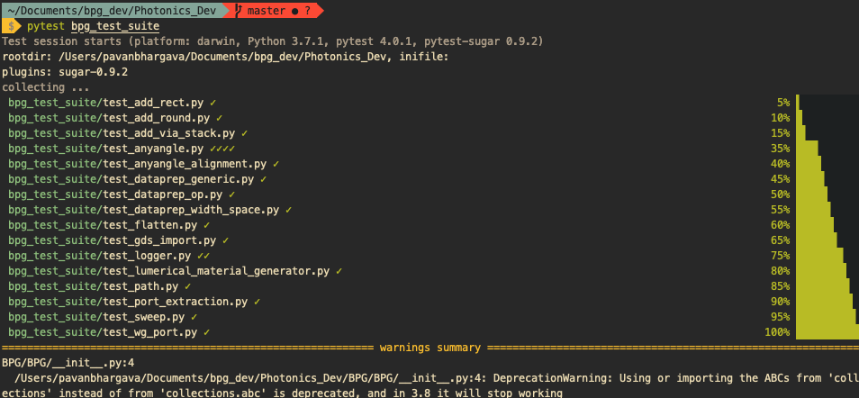

# Installing BPG

## Prerequisites
We highly recommend you use an [Anaconda](https://www.anaconda.com/distribution/) environment with a Python version 
greater than 3.6. BPG generally will not function with Python versions less than 3.6, and requires packages with 
C/C++ dependencies that are most easily installed using Anaconda.

Once Anaconda is set up, please run the following commands to install packages with C/C++ dependencies:
```bash
conda install numpy
conda install rtree
conda install shapely
```

BPG generally generates output layouts in the GDSII format. To view these layouts, we recommend you install and use the 
free open-source software package, [Klayout](https://klayout.de).

## Installing BPG
Once the prerequisites have been installed, you can easily install BPG with:
```bash
pip install bpg
```

## Quick Workspace Setup
BPG requires specific environmental variables and a PDK for your technology in order to run. We provide an example 
workspace and PDK for you to quickly get started. To set up your workspace run the following:
1. `bpg setup_workspace`. This copies over the example technology and environment variable setup file
2. `source sourceme.sh`. This will setup all of the necessary environment variables
3. Now you can execute any BPG based python script by running `python3 <INSERT PATH TO PYTHON FILE HERE>`

To get some example generators and learn more about how BPG works, please check out the tutorial section in getting 
started.

## Testing BPG
You may wish to run BPG's test suite to make sure that it functions properly on your system. To do so, first make sure
that you have the example tech setup by running the instructions in the `Quick Workspace Setup` section, and that you. 
have `pytest` installed. Then run
```bash
bpg setup_test
pytest bpg_test_suite
```
If you do not have pytest installed, do so by running `pip install pytest`, then re-run `pytest bpg_test_suite`. 
After running the test suite, you should see something similar to this, with a few warnings and messages below:


